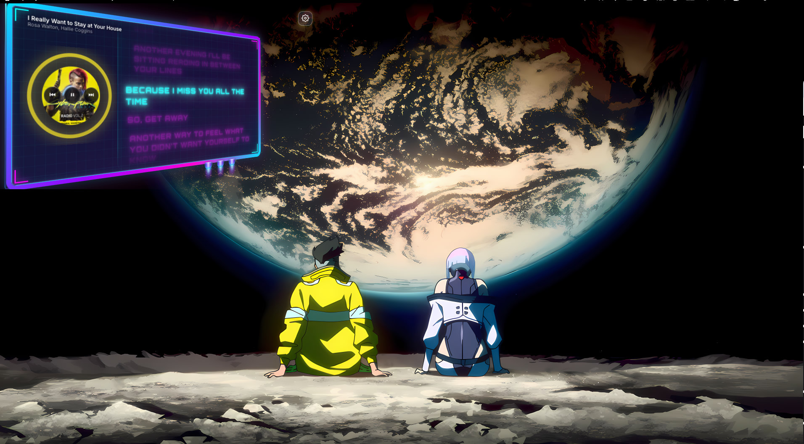
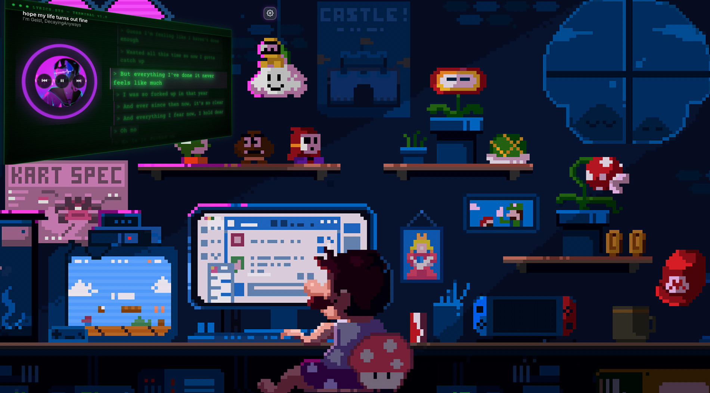
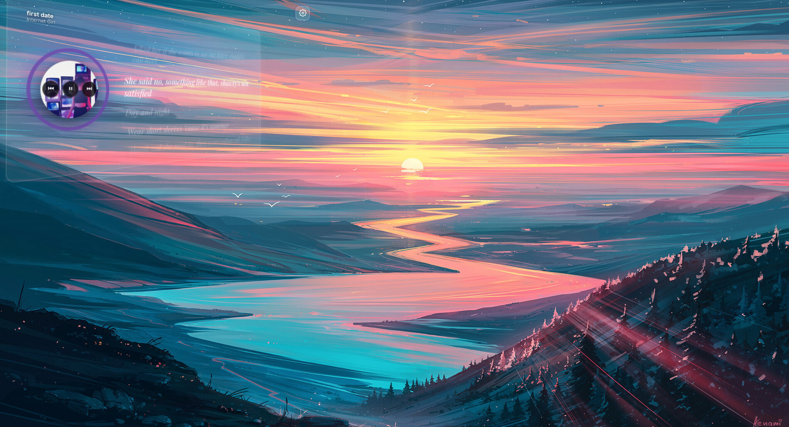
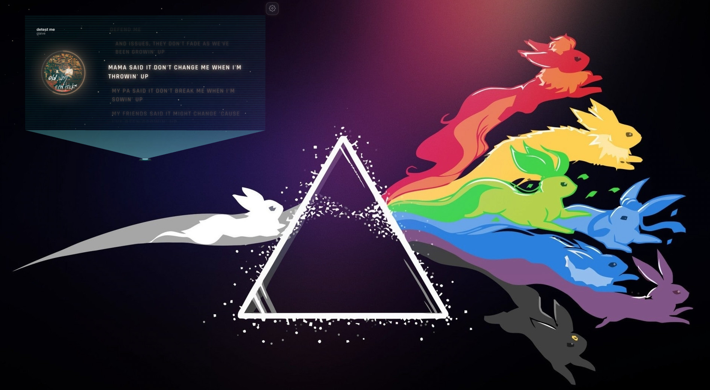

<p align="center">
  
</p>

<h1 align="center">Cadence</h1>

<p align="center">A floating, click-through desktop overlay for Spotify — synced karaoke lyrics, an audio-reactive visualizer, album-adaptive theming, a 3D tilt with holographic frames, and a pile of toggleable effects. Now with <b>listen along</b>: share a link and your friends see your lyrics live. Mac + Windows.</p>

<p align="center">
  <a href="https://github.com/MowkE/cadence/releases/latest/download/Cadence-mac-arm64.dmg"></a>
  &nbsp;
  <a href="https://github.com/MowkE/cadence/releases/latest/download/Cadence-mac-x64.dmg"></a>
  &nbsp;
  <a href="https://github.com/MowkE/cadence/releases/latest/download/Cadence-win-x64-Setup.exe"></a>
</p>

<p align="center">
  
  <em align="center">Cyberpunk — neon billboard with thrusters</em>
</p>

<p align="center">
  
  <em align="center">Retro — CRT terminal with typewriter lyrics</em>
</p>

<p align="center">
  
  <em align="center">Ethereal — aurora glass, album-adaptive fonts and colors</em>
</p>

<p align="center">
  
  <em align="center">Hologram projector — the overlay beams out of a lens at the bottom of the screen</em>
</p>

## Download

No terminal, no Python, no editor. Grab the installer for your machine:

| | Download | Then |
|---|---|---|
| **Mac — Apple Silicon** (M1/M2/M3/M4) | [Cadence-mac-arm64.dmg](https://github.com/MowkE/cadence/releases/latest/download/Cadence-mac-arm64.dmg) | Open the DMG, drag Cadence to Applications |
| **Mac — Intel** | [Cadence-mac-x64.dmg](https://github.com/MowkE/cadence/releases/latest/download/Cadence-mac-x64.dmg) | Open the DMG, drag Cadence to Applications |
| **Windows** (64-bit) | [Cadence-win-x64-Setup.exe](https://github.com/MowkE/cadence/releases/latest/download/Cadence-win-x64-Setup.exe) | Run it — installs in a few seconds, no admin needed |

All versions live on the [Releases page](https://github.com/MowkE/cadence/releases).

> **First launch, because the app isn't signed with a paid developer certificate:**
>
> - **Mac:** the first open says Apple can't verify it. Click **Done**, then go to **System Settings → Privacy & Security**, scroll down and press **Open Anyway** (once). If you'd rather use Terminal: `xattr -cr /Applications/Cadence.app`.
> - **Windows:** SmartScreen shows "Windows protected your PC". Click **More info → Run anyway** (once).

Cadence lives in your **menu bar (Mac)** / **system tray (Windows)** — that's where *Show / Hide / Settings / Quit* are.

## Features

- **No setup, no Premium** — reads the Spotify app on your Mac or PC directly; no developer app or API keys needed
- **Synced lyrics** from LRCLIB (karaoke-style line highlighting), with Genius as an automatic fallback
- **Listen along** — start a session, share the code or `cadence://` link, and friends follow your lyrics live in their own overlay; Cadence can also play the same song on their speakers, in sync. See who's listening by name, and let them **request songs**
- **Karaoke & games** — full-screen karaoke, duets, guess the song, finish the line, beat tap, type the line; solo or with your session
- **Shortcuts and auto-hide** — global hotkeys to show/hide the overlay, and fade-out after N minutes of silence
- **Three lyric styles** — Cyberpunk, Ethereal, Retro (terminal + typewriter) — plus an **Auto** mode that picks a style and one of 30 fonts per track based on the album art
- **Album-adaptive theming**: colors extracted from the cover tint the lyrics, visualizer, and UI
- **3D parallax tilt** with per-style hover frames: neon billboard (with thrusters), CRT terminal, aurora glass
- **Hologram projector** mode — a lens at the bottom of the screen projects the overlay; click it to power the hologram down/up
- **Playback controls** on hover, plus **ring scrubbing**: drag the progress arc around the album art to seek
- **Layouts**: full, focus (3-line), mini ticker bar, and **Notch** — just the current line, pinned to the top-centre of the screen under the camera notch, nothing else
- **Extras**: lyric translation, chorus fireworks, portal transitions between songs, star field, vinyl spin, night shift, daily listening recap, ambient screensaver mode when idle
- **Mac and Windows**, one codebase, no Python or extra installs

## Setup: there isn't any

Cadence reads what's playing straight from the Spotify desktop app on your computer — no developer app, no API keys, and **no Premium**. Install it, open Spotify, play something.

- **Mac:** the first time, macOS asks whether Cadence may control Spotify — click **Allow**. (Changed your mind later? System Settings → Privacy & Security → Automation.)
- **Windows:** nothing to approve. Cadence listens to the system media session Spotify already reports to — the same thing the volume flyout shows. Album art comes from a free iTunes/Deezer lookup, so it can occasionally differ from Spotify's.

Free accounts get everything: lyrics, visuals, and the play/pause/skip/seek controls in the overlay.

### Optional: Spotify Web API keys

You can also connect through Spotify's Web API with your own keys (gear → 🔑). It adds two things: following playback on your *other* devices (phone, speakers), and — on Windows — playing along in a friend's listen-along session. **Since February 2026 Spotify requires a Premium account to create a developer app** (and caps each app at 5 users), so this is strictly opt-in.

1. Go to [developer.spotify.com/dashboard](https://developer.spotify.com/dashboard) and log in with your Spotify account
2. Click **Create app** — name and description can be anything (e.g. "Cadence")
3. Under **Redirect URIs**, add exactly:
   ```
   http://127.0.0.1:8888/callback
   ```
4. Save, then open the app's **Settings** to find your **Client ID** and **Client Secret**
5. In Cadence, gear → 🔑, paste both and press **Connect**. Your browser opens once for Spotify's approval.

The **Spotify** section in settings picks the source: **Auto** (the Web API while it's connected, otherwise the Spotify app), **Spotify app**, or **Web API**.

## Listen along

Share your music with a friend who also has Cadence:

**Host:** gear → **Listen along** → **Start a session**. Cadence generates a code like `K7PM-3QXZ` and copies an invite (`cadence://join/K7PM-3QXZ`) to your clipboard. Paste it to a friend. The panel shows how many people are listening; **End** stops the session.

**Friend:** click the link (it opens Cadence) or paste the code into gear → **Listen along** → **Join**. Their overlay switches to your track and lyrics, in sync with where you are in the song — even if they haven't connected Spotify. With **Play on my Spotify too** on (default), Cadence also starts the same song on their Spotify at the same position, follows your skips, pauses and seeks, and pauses when they leave. That part needs the Spotify app open on their side; on Mac any account works, on Windows it needs Web API keys (see above).

**Names:** the host's panel lists who's listening by name. Cadence uses your Spotify display name (Web API) or your account name on this computer; set anything you like in gear → **Listen along** → *Your name*.

**Handoff:** each listener in the host's panel has a 🎧→ button — press it and that friend becomes the host while you keep listening. If the host quits Cadence with people still listening, the session hands itself to the first listener instead of ending.

**The room picks the next song** (host toggle in the hosting panel): in the last 30 seconds of each song, the pending requests go to a 20-second vote on everyone's overlay — up to 4 options, one pick each — and the winner plays next, automatically. A single request just plays. Ties go to the earliest request; losing requests stay in the list for the next vote.

**Song requests:** guests paste a Spotify song link (Spotify → Share → Copy Song Link) or press **Request what I'm playing**. The host sees the request with album art and who asked, and can **▶ play it now**, **＋ queue it** (Web API only), or **✕ pass** — guests get told which happened.

How it works: your overlay publishes tiny "state" messages (track, position, playing) to a private, randomly named topic on [ntfy.sh](https://ntfy.sh) — only when something changes, never your audio or account. Guests subscribe to that topic. Anyone with the code can follow, so share it like a party invite. Self-hosting? Point Cadence at your own ntfy server by adding `{ "relay": "https://ntfy.example.com" }` to `settings.json` in the app's data folder (Mac: `~/Library/Application Support/spotify-overlay/`, Windows: `%APPDATA%\spotify-overlay\`) or setting `CADENCE_RELAY`.

## Karaoke & games

Gear → **🎤 Open Karaoke & games**. A setlist of room games that run on the synced lyric timing Cadence already has — no microphone, no extra accounts. Everyone in your listen-along session gets a colour, and that's how people show up in every game. The host starts the friends games; everyone's overlay follows.

| Game | Who | What |
| --- | --- | --- |
| **Karaoke** | anyone | The overlay goes full-screen: big lyrics that fill as each line plays, a countdown through instrumental gaps, the next line waiting below. |
| **Guess the song** | friends | The title and art hide for everyone but the host, who DJs. Friends race to name the song — first correct answer wins the round, earlier is worth more, the host drops hints at 20 s and 45 s. Skipping to the next song starts a new round. |
| **Duet** | friends | The host picks two people. Alternate lines, switch every verse, or *pass the mic* at random; chorus is for both. Your lines pulse in your colour. |
| **Hot mic** | friends | Every line is dealt to someone in the room, the chorus to everyone. Your name shows a line ahead, so you can see yours coming. |
| **Lyric liar** | friends | A line a little way ahead is hidden from everyone's lyrics. Each person writes a fake version, then the room votes on which is real. 3 points for spotting the real one, 2 for every vote your fake takes. Rounds are timed off the song itself. |
| **Finish the line** | friends | The last words of an upcoming line vanish from everyone's lyrics. Type them before the line plays — fastest correct answer wins it, everyone else who's right still scores. |
| **Beat tap** | solo | Every lyric line is a note sliding toward the bar — hit space (or click) as it lands. Perfect / Good / OK, combos, accuracy. |

Press **Esc** to leave a game or close the panel.

## Usage

- **Drag the gear** to move the overlay; **click it** for settings
- **Shortcuts** (global, configurable in settings): **Ctrl/⌘ + Shift + H** shows or hides the overlay, **Ctrl/⌘ + Shift + L** opens settings from anywhere
- **Resize** with the Size slider in settings, or drag the **⤡ grip** at the overlay's bottom-right corner
- **Auto-hide when paused**: pick 1 / 5 / 15 minutes and the overlay fades out after that long without music, fading back in when something plays; hover it to peek
- The window is click-through everywhere except its controls. If something underneath still isn't getting your clicks, turn on **Click-through lock** (settings, or the tray menu): the overlay then never takes the mouse unless a panel is open
- On Windows the overlay re-asserts itself above borderless/windowed-fullscreen apps (games, video). Exclusive-fullscreen games can't be overlaid by any window — switch the game to borderless
- Hover the album art for playback controls; with Progress arc enabled, drag the ring around the art to scrub through the song
- Play music and go idle for a minute — Cadence becomes a full-screen ambient lyric display until you touch the mouse or keyboard
- Menu bar / tray icon: show, hide, open settings, copy the invite link while hosting, quit

## Run from source

Requirements: [Node.js](https://nodejs.org) 18 or newer. That's it — no Python.

```bash
git clone https://github.com/MowkE/cadence.git
cd cadence
npm install
npm start
```

Build installers locally with `npm run dist:mac` or `npm run dist:win` (output in `dist/`). Releases are built by [GitHub Actions](.github/workflows/release.yml) for Mac (Apple Silicon + Intel) and Windows whenever a `v*` tag is pushed:

```bash
git tag v2.1.0 && git push origin v2.1.0
```

## License

MIT
